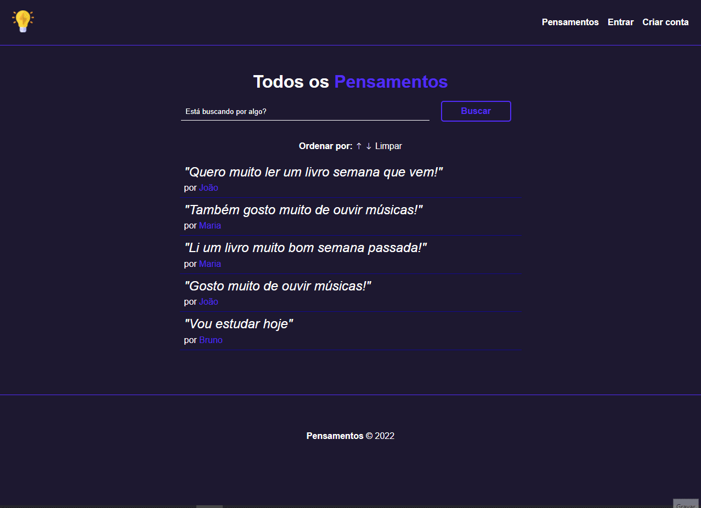

 

    

  <h3 align="center">Pensamentos com NodeJS, Express, Sequelize e PostgreSQL</h3>
  
  

     Pensamentos
      

  <a href="#sobre"> Sobre </a> |
  <a href="#conhecimentos-praticados"> Conhecimentos praticados </a> |
  <a href="#rotas-da-aplicação"> Rotas da aplicação </a> |
  <a href="#tecnologias-utilizadas"> Tecnologias utilizadas </a>      
        
     
    <h1 align="center">
    
 </h1>
  

# Sobre
O objetivo do projeto foi criar um sistema para compartilhar Pensamentos, com a finalidade de colocar em prática os meus conhecimentos em Express, Autenticação, Sequelize e MVC.

Na aplicação é possível cadastrar um usuário, logar com um usuário, visualizar todos os pensamentos enviados outros usuários, visualizar os pensamentos enviados pelo próprio usuário e adicionar, editar, excluir, buscar e filtrar pensamentos.

# Conhecimentos Praticados
✔ NodeJs  
✔ Express  
✔ Express-session  
✔ Sequelize  
✔ CRUD com Sequelize  
✔ Padrão MVC

# Rotas da aplicação:

## Autenticação

<b>[GET] </b> /login : A rota deve exibir o formulário de login.  

<b> [POST] </b> /login : A rota deve fazer o login de um usuário.  

<b>[GET] </b> /register : A rota deve exibir o formulário de registro.  

<b>[POST] </b> /register : A rota deve salvar um novo usuário no banco de dados.  

<b>[GET] </b> /logout: A rota deve excluir a sessão de um usuário logado. 

## Pensamentos

<b>[GET] </b> /pensamentos/ : A rota deve exibir todos os Pensamentos.  

<b>[GET] </b> /pensamentos/dashboard : A rota deve exibir o dashboard do usuário se o usuário estiver logado.  

<b>[GET] </b> /pensamentos/add : A rota deve exibir o formulário de criação de pensamento se o usuário estiver logado.  

<b>[POST] </b> /pensamentos/add : A rota deve adicionar um pensamento no banco de dados se o usuário estiver logado.  

<b>[GET] </b> /pensamentos/edit/:id : A rota deve exibir o formulário de edição de pensamento de acordo com o ID do pensamento passado na URL se o usuário estiver logado.  

<b>[POST] </b> /pensamentos/edit : A rota deve alterar o pensamento no banco de dados se o usuário estiver logado.  

<b>[POST] </b> /pensamentos/remove : A rota deve remover um pensamento no banco de dados.  

# Tecnologias utilizadas: 

   

---
**Desenvolvido por <a href="https://www.linkedin.com/in/bruno-andreotti/">Bruno Andreotti</a> .** 